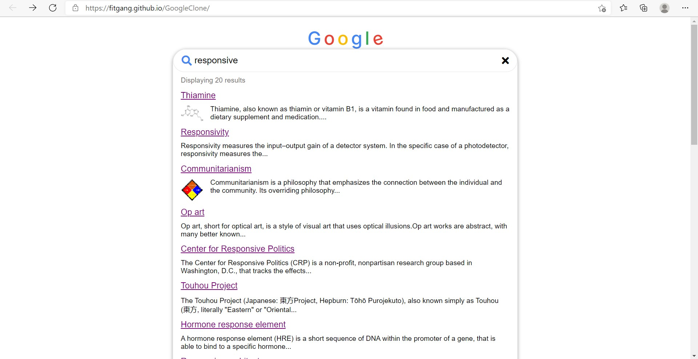
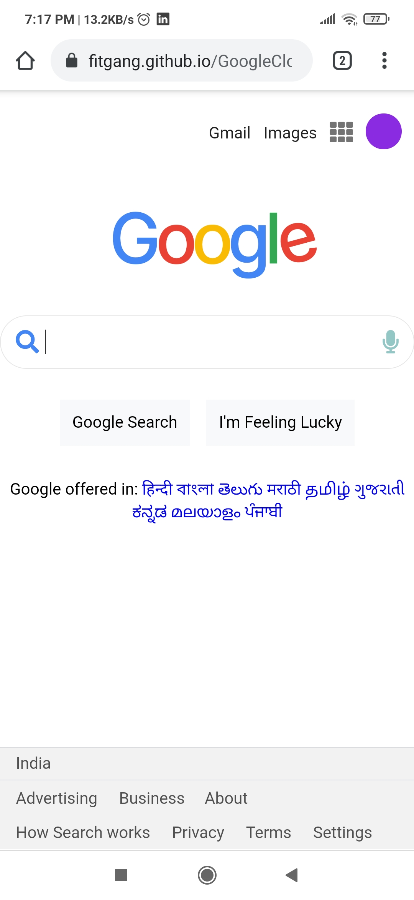

# GoogleClone

This is a google clone <strong><i>powered by Wikipedia</i></strong>. It tries to mimic the google search engine with the help of the wikipedia api.

This clone is <strong><i>responsive</i></strong> and have a <strong><i>mobile-first design</i></strong>.
The clone is designed by using compiled <strong><i>sass</i></strong>.
And it also has <strong><i>accessibility</i></strong> features making it suitable for screen readers.

Thanks to freecodecamp for the tutorial.
